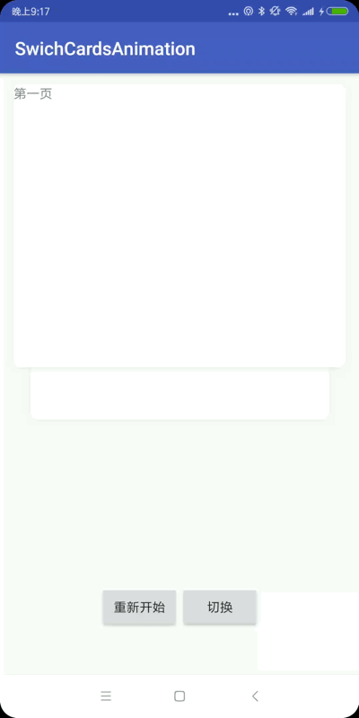

# SwichCardsAnimation

卡片切换动画

## 截屏


## 参数
- animType : 动效展示类型
  - front : 将点击的卡片切换到第一个
  - switchPosition : 将点击的卡片和第一张卡片互换位置
  - frontToLast : 将第一张卡片移到最后，后面的卡片往前移动一个
- cardRatio : 卡片宽高比
- animDuration : 卡片动效时间
- animAddRemoveDelay : 卡片组切换时，添加与移出时，相邻卡片展示动效的间隔时间
- animAddRemoveDuration : 卡片组切换时，添加与移出时，卡片动效时间

## 使用
### xml布局
```xml
<sky.library.SkySwitchView
        android:id="@+id/view"
        android:layout_width="match_parent"
        android:layout_height="wrap_content"
        app:animDuration="500"
        app:cardRatio="1"/>

```
### 设置Adapter
直接继承BaseAdapter
```java
class MyAdapter extends BaseAdapter{
  ...
}

```
### 动效的转换和插值
#### 默认
默认情况下可以不设置，或者设置为各种Default
```java
setAnimInterpolator(new LinearInterpolator());
setTransformerToFront(new DefaultTransformerToFront());
setTransformerToBack(new DefaultTransformerToBack());
setZIndexTransformerToBack(new DefaultZIndexTransformerCommon());

```